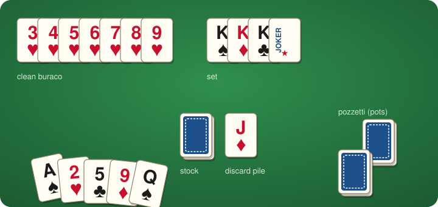

# PHP Buraco library

[](https://packagist.org/packages/garak/buraco)
[](https://packagist.org/packages/garak/buraco)
[](https://packagist.org/packages/garak/buraco)
[](https://packagist.org/packages/garak/buraco)
[](https://qlty.sh/gh/garak/projects/buraco)
[](https://qlty.sh/gh/garak/projects/buraco)



## Introduction

This library offers PHP classes for building a buraco (Italian: burraco) game: two decks with four jokers,
two players or two partnerships, a shared table per team, a discard pile and the two pozzetti.
It is built on top of [garak/card](https://github.com/garak/card):

* `Game` — one hand: players, teams, hands, stock, discard pile, pozzetti, turns and scores
* `Player` _(abstract, needs to be extended)_
* `Team` — the two sides of the game
* `Rules` — game parameters, with the Italian tournament rules as defaults and an `international()` preset
* `Hand` — the cards held by a player
* `Meld`, `Set`, `Run` — valid combinations laid on the table, and the kind of `Buraco` they make
* `Table` — the melds of a team
* `Score` — the breakdown of a team's score
* `MeldFinder` — what can be melded with a bunch of cards, useful for hints

Want to see it in action? Go to [burraco.garak.it](https://burraco.garak.it/) and play it yourself!

### Rules

Defaults follow the Italian tournament code (FITAB). All numbers are configurable through `Rules`.

* Two decks plus four jokers, 108 cards. Each player gets 11 cards, two pozzetti of 11 cards are set aside,
  the first card of the stock is turned face up to start the discard pile.
* **Wildcards** are the jokers and the twos. A two of the right suit sitting right before the three is a natural two.
* A **set** is 3 to 9 cards of the same rank, suits don't matter. A **run** is 3 to 14 consecutive cards of the same
  suit; the ace is low when it comes first (A,2,3) and high when it comes last (Q,K,A), never both.
  A meld holds at most one wildcard, and a team cannot have two sets of the same rank.
* On their turn, a player **draws** a card from the stock or **takes** the whole discard pile, **melds** as much as
  they like on the team's table (new melds, or cards added to existing ones), and **discards** one card.
* A **buraco** is a meld of 7 or more cards. A clean one (no wildcard) is worth 200 points, a dirty one 100,
  a semi-clean one (wildcard at either end of 7 natural cards) 150. A royal buraco (all the 13 cards of a suit) is
  worth 300, or 250 with a wildcard; a super buraco (all the 8 cards of a rank) 250, or 200 with a wildcard.
* A player who melds or discards their last card takes the team's **pozzetto** and goes on with it: in the same
  turn when melding, from the next turn when discarding.
* Once the pozzetto is gone, discarding the last card **closes** the game: it needs a buraco on the table, and
  the card cannot be a wildcard. Melding the last card is not allowed. Closing is worth 100 points.
* The game also ends, without closing bonus, with the turn of the player who draws the third-to-last card of the stock.
* Each team scores the buraco bonuses, the closing bonus and the value of its melded cards, minus the value of the
  cards left in the hands of its players and 100 points if it never took the pozzetto.
  Cards are worth 30 (joker), 20 (two), 15 (ace), 10 (8 to K) or 5 (3 to 7) points.

`Rules::international()` follows the F.I.Bur. code instead: a clean buraco is needed to close, sets can be made
only of aces and threes, the discard pile can be taken only when at least one card can be melded with it, and
there are no semi-clean, royal or super buracos.

Melds can be rearranged freely as long as every card stays in its meld and the result is valid: this is a little
more permissive than the tournament rule about moving a wildcard only when the card it stands for is added.

## Installation

Run `composer require garak/buraco`.

## Usage

```php
<?php

require 'vendor/autoload.php';

use App\Player;  // your Player class, extending \Garak\Buraco\Player
use Garak\Buraco\Game;
use Garak\Buraco\Meld;
use Garak\Buraco\Rules;
use Garak\Buraco\Team;
use Garak\Card\Card;

$game = new Game(new Rules());  // Rules are optional, defaults are the ones above
$marty = new Player('Marty McFly');
$biff = new Player('Biff Tannen');
$game->join($marty);
$game->join($biff);
$game->deal();

$player = $game->getCurrentPlayer();  // Marty
echo $game->getHand($player)->toText();
echo $game->getPhase()->name;         // Draw
echo $game->getTopDiscard();

// A turn starts with a draw...
$card = $game->draw($marty);
// ...or by taking the whole discard pile
$cards = $game->takeDiscardPile($marty);

// then the player melds as many times as they like, submitting the new layout of the team's table
$game->meld($marty, [
    Meld::createFromString('Kh,Kd,Ks'),      // a set
    Meld::createFromString('5c,6c,wb,8c'),   // a run, with a joker standing for the 7
]);
$game->meld($marty, [
    Meld::createFromString('Kh,Kd,Ks,Kc'),   // adding a card to the set
    Meld::createFromString('5c,6c,7c,8c,wb'), // adding the 7 and moving the joker
]);

// and ends the turn with a discard
$game->discard($marty, Card::fromRankSuit('Jd'));

// State
$game->getTable($marty);           // Table, with getMelds(), getCards(), getBuracos()
$game->getTable(Team::Second);     // the opponents' table
$game->hasTakenPozzetto($marty);
$game->getStockCount();
$game->getDiscards();              // list<Card>, bottom to top
$game->isLastTurn();               // the stock is exhausted, the game ends with this turn
$game->getCurrentPlayer();
$game->isOver();
$game->getClosingTeam();           // Team or null
$game->getWinner();                // Team or null
$game->getScore($marty)->total;    // Score, with buracos, closing, table, hands, pozzetto and total
```

With four players, the first and third to join are one team and the second and fourth the other.
Partners share the table and the pozzetto: `getTeam()` and `getTeamPlayers()` tell who is with whom.

Illegal moves throw a `Garak\Buraco\Exception\IllegalMoveException` (a `NotYourTurnException` when
playing out of turn). Invalid melds throw a `Garak\Buraco\Exception\InvalidMeldException` on construction.
All exceptions implement `Garak\Buraco\Exception\BuracoException`.

A play that would leave the player with a single card they cannot discard (a wildcard, or a card that would
close the game without a buraco) is refused up front, so the player is never stuck.

### Melds

`Meld::createFromString()` and `Meld::fromCards()` guess the type: a `Set` when all the cards that are not
jokers or twos share the rank, a `Run` otherwise. Use `new Set($cards)` or `new Run($cards)` to be explicit.
Runs must be given in ascending order, so that wildcards get the value implied by their position; a wildcard
after the king stands for a high ace. Pass `anyOrder: true` to let the library sort the cards of a run for you:
naturals go ascending, the ace low unless it only fits high, a joker is tried from the end backwards, and a two
of the run's suit goes in its natural place when it fits. Cards already forming a valid meld are kept as given.

```php
Meld::createFromString('3h,2h,Ah', anyOrder: true);  // Ah,2h,3h
Meld::createFromString('3h,2h,wb', anyOrder: true);  // 2h,3h,wb
Table::createFromString('Kh,Kd,Ks;7c,5c,wb', anyOrder: true);
```

When no order makes a run, the exception describes the cards as given.

```php
$run = new Run([...]);   // 2h,3h,4h,wb
$run->getValues();       // [2, 3, 4, 5]
$run->getWildcard();     // wb: the two of hearts is natural here
$run->getBuraco();       // null, or a case of the Buraco enum for 7 cards and more
$run->getPoints();       // 65

MeldFinder::attach($run, Card::fromRankSuit('5h'));  // 2h,3h,4h,5h,wb
MeldFinder::canMeld($cards, $table, $rules);         // whether anything can be laid down
```

### Strings

Cards are written as rank plus suit (`Kh`, `Tc`, `wb` for the black joker), optionally followed by the back
colour (`Khr`, `Khb`) to tell the two decks apart. Melds are comma-separated, tables are semicolon-separated:

```php
Table::createFromString('Kh,Kd,Ks;5c,6c,7c');
$table->toString(withBack: true);  // "Khr,Kdb,Ksr;5cr,6cr,7cb"
```

### Testing

`Game::deal()` accepts a pre-arranged deck. Cards are dealt from the start of the array: hand size cards to each
player in turn, then pozzetto size cards to each team, then the card that starts the discard pile, and the
remaining ones form the stock (the next card to be drawn first):

```php
$game->deal([...]);  // e.g. built with Card::fromRankSuit()
```

## Development

The repository ships a Docker setup (PHP 8.5 CLI with pcov) and a Makefile wrapping the usual commands.
You need [Docker Compose](https://docs.docker.com/compose/). `make` is optional: every target is a one-liner
you can copy from the Makefile.

Initial setup:

```bash
make build     # build the image
make start     # start the container
make install   # composer install
```

Day-to-day:

```bash
make test      # phpunit
make coverage  # phpunit with coverage, HTML report in build/
make stan      # phpstan, level 9 with strict rules
make cs        # php-cs-fixer, fixes files in place
make stop      # stop the container
```

Run `make help` for the full list.

Conventions:

* Keep `make test`, `make stan` and `make cs` green before opening a pull request. CI runs the same checks
  on every supported PHP version, plus a job with the lowest allowed dependencies.
* Write unit tests for every change. Cover new game rules with a full scenario in `GameTest`, using
  `Game::deal()` with a pre-arranged deck.
